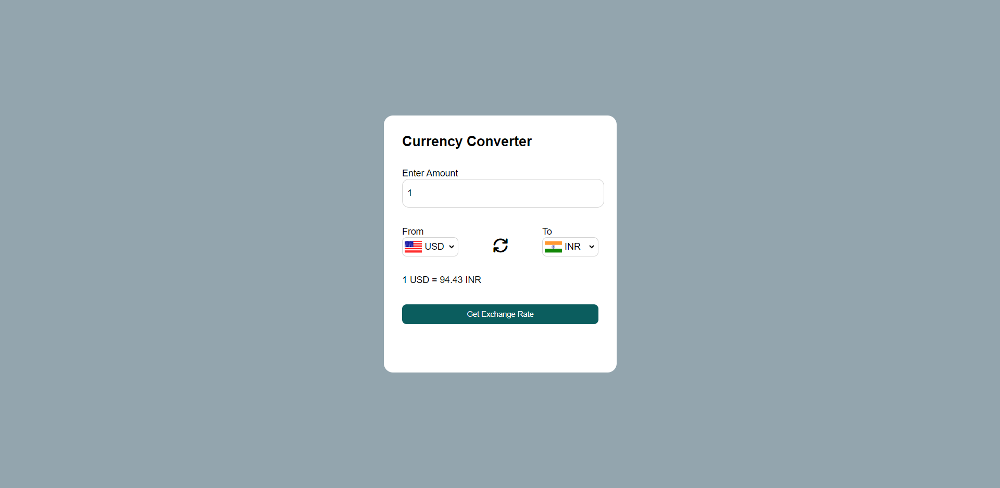

# 💱 Currency Converter

A simple and dynamic **Currency Converter Web App** built using **JavaScript**, which fetches real-time exchange rates from an API and converts between different currencies.

---

## 🚀 Features

- 🔄 Convert between multiple currencies  
- 🌍 Real-time exchange rates using API  
- 🇮🇳 Country flags update dynamically  
- 🔁 Swap currencies feature  
- ⚡ Instant calculation on selection change  
- 🎯 Clean and responsive UI  

---

## 🛠️ Tech Stack

- HTML  
- CSS  
- JavaScript (Vanilla JS)  
- Fetch API  

---

## 📸 Preview




---

## 🔧 How It Works

1. User enters an amount  
2. Selects **From** and **To** currencies  
3. App fetches exchange rate from API  
4. Displays converted amount instantly  

---

## 🌐 API Used

- https://latest.currency-api.pages.dev/

---

## 📂 Project Structure

```
Currency-Converter/
│── index.html
│── style.css
│── Converter.js
│── codes.js
│── screenshot.png
```

---

## ▶️ Run Locally

1. Clone the repository  

```bash
git clone https://github.com/HarshGupta464/Javascript-Projects.git
```

2. Navigate to the project folder  

```bash
cd Javascript-Projects/Currency\ Converter
```

3. Open `index.html` in your browser  

OR  

Use the VS Code **Live Server** extension for better experience.

---

## 💡 Future Improvements

- Add loading spinner ⏳  
- Better error handling ⚠️  
- Add more currencies 🌍  
- Improve UI/UX 🎨  

---

## 👨‍💻 Author

**Harsh Gupta**

---

## ⭐ Support

If you like this project, consider giving it a ⭐ on GitHub!
